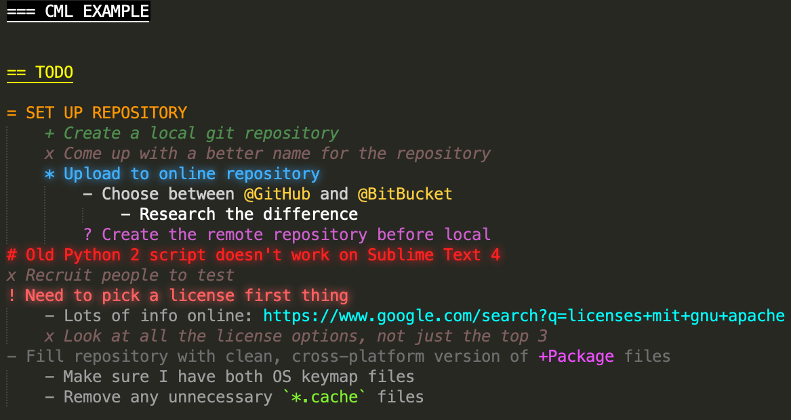
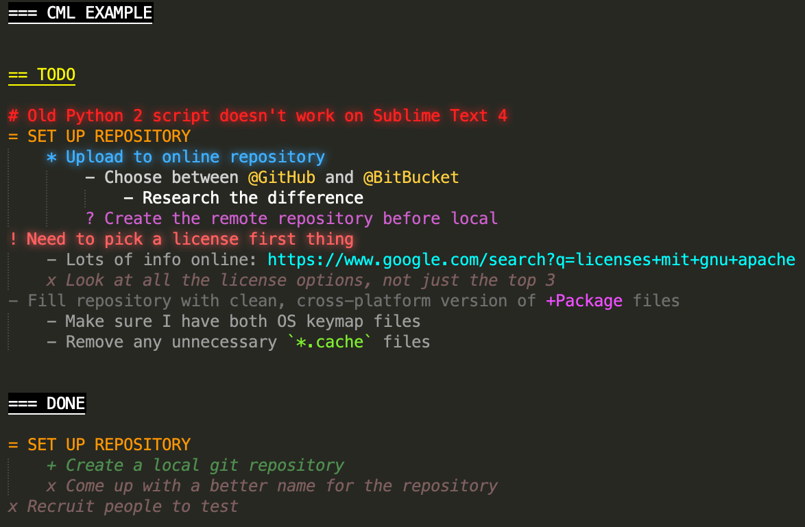

# SublimeText-CML - A TODO-style syntax theme and macro
 CML file theme, language, and macros for Sublime Text 4+

## What is it?
This is a Package for Sublime Text 4 and up (though it may also work on 3, perhaps without some of the coloring features).

When installed, any file ending in `.cml` will get special coloring and the option to "cleanup" the file with a macro.

This file format is meant to be a todo-list, with one item per line.  However, there are special markers for lines that denote headings, completed, cancelled, bugs, alerts, and questions.  You can define a hierarchy of items via tab-indentation.

When you press the macro key-combo (`Ctrl-Alt-C` on **Windows**, `Cmd-Option-C` on **OSX**), it runs a Python 3 script to move "finished" (completed or cancelled) lines into a DONE section and sort still-active lines based on an importance criteria.  The macro preserves the hierarchy of items, replicating it into the DONE section if necessary.

### Example before cleanup:

### Example after cleanup:

## How to use
In Sublime Text, go to Browse Packages and copy the **CML**, **Color Scheme - Default**, and **User** folders into it.

## Why CML?
It's not taken, as far as I can tell!  Plus the author's name is Chris, so you could cheekily call this the Chris Markup Language.